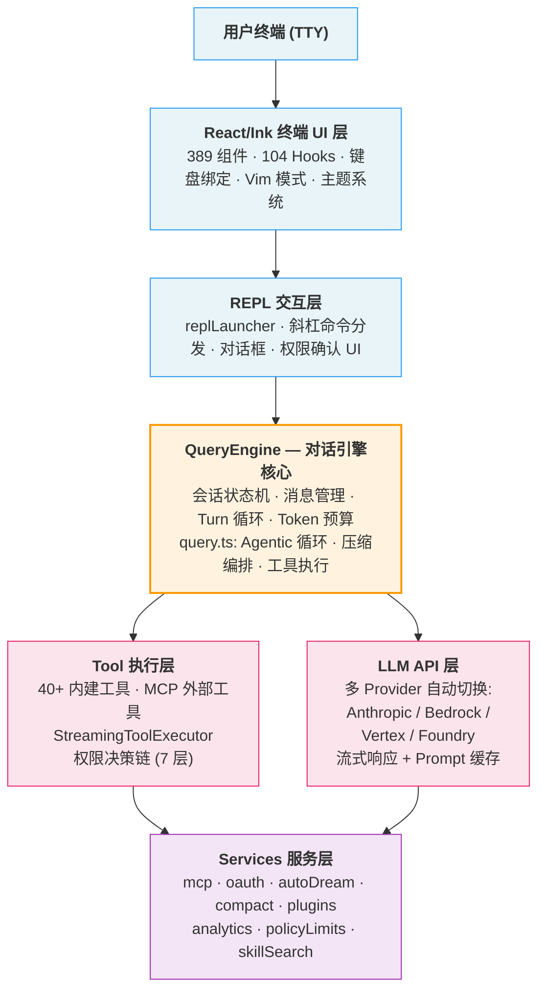
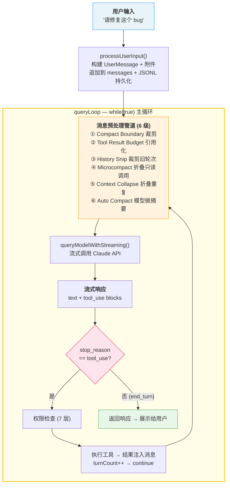
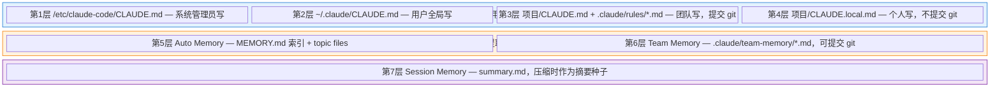
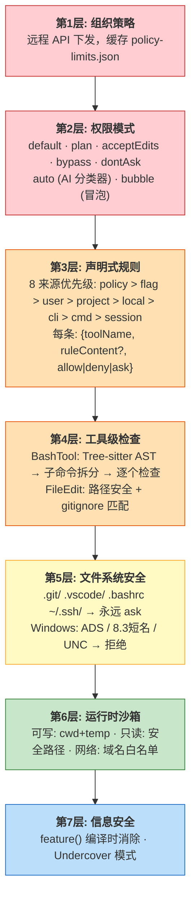
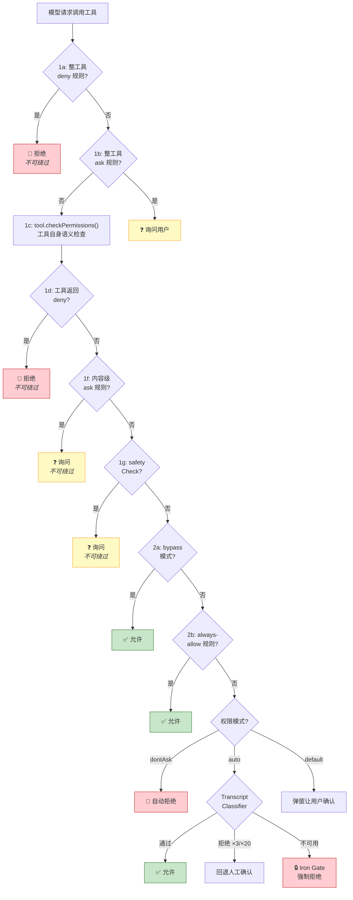
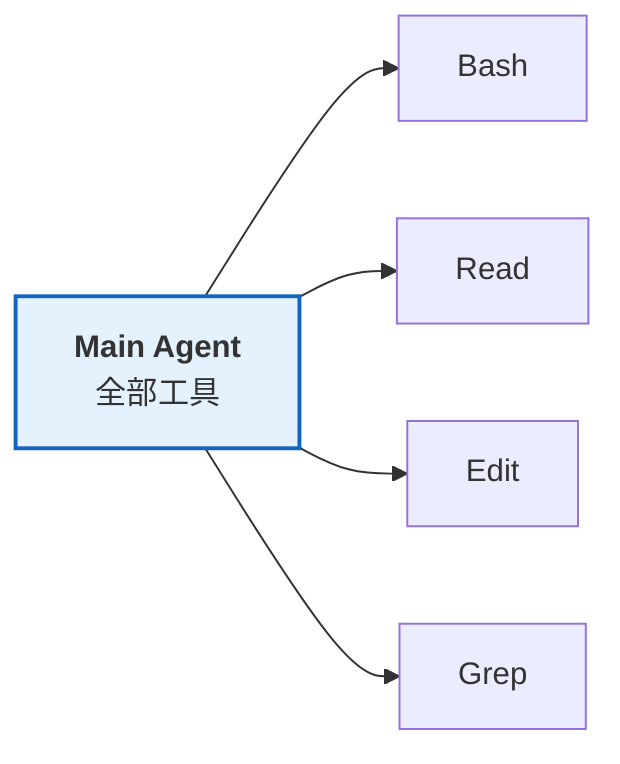
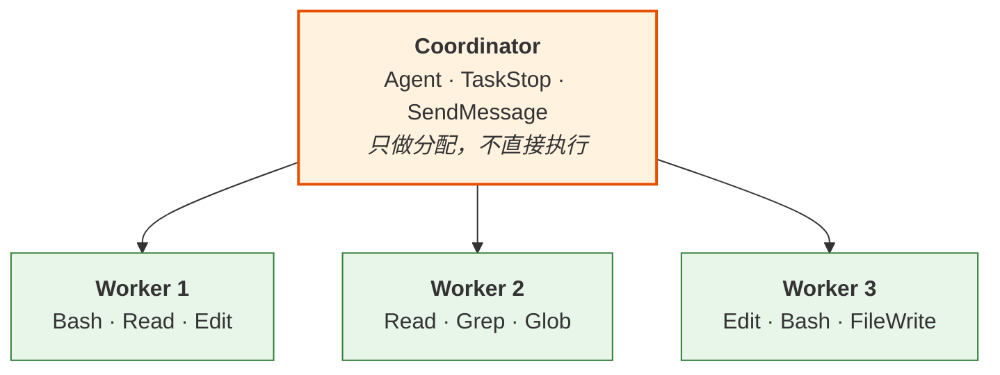
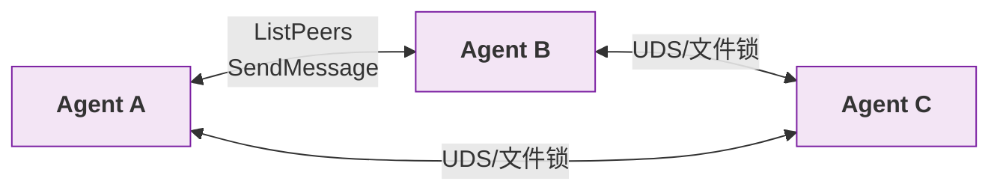
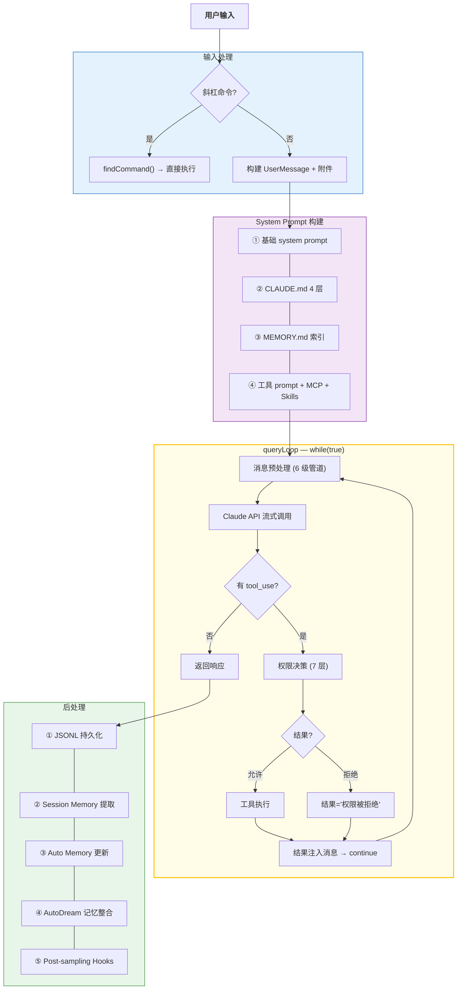

# 深入 Claude Code 源码：一个工业级 AI Agent 的架构全解析

> 2026 年 3 月底，Claude Code 的完整 TypeScript 源码因 npm sourcemap 泄露。我花两周写了 21 篇、18,000 行的技术文档来拆解它。这不是一个功能介绍帖——这篇文章会带你看到**真正的架构设计**、**真实的代码结构**和**具体的工程决策**。

---

## 工程规模：先建立直觉

在聊架构之前，先对这个项目的规模有个体感：

```
src/
├── 1,902 个源文件 (1,884 .ts/.tsx, 18 .js)
├── main.tsx              # 4,684 行 — CLI 主入口
├── QueryEngine.ts        # ~1,296 行 — 核心对话引擎
├── query.ts              # ~1,730 行 — Agentic 查询循环
├── tools.ts              # 390 行 — 工具注册中心
├── Tool.ts               # ~793 行 — 工具基础类型定义
├── commands.ts           # 755 行 — 命令注册中心
│
├── components/           # ~389 文件 — React/Ink UI 组件
├── tools/                # ~184 文件 — 40+ Agent 工具实现
├── services/             # ~130 文件 — MCP、OAuth、压缩、记忆整合
├── hooks/                # ~104 文件 — React Hooks
├── commands/             # ~207 文件 — 70+ 斜杠命令
└── utils/                # ~564 文件 — 最大模块
```

技术栈：**TypeScript (strict) + Bun + React/Ink + Commander.js + Zod v4 + MCP**。终端应用，但用 React 做了完整的组件化 UI。

---

## 一、整体分层架构



这个分层的核心设计决策是 **REPL 和 SDK 共用同一个 QueryEngine**。不管你是在终端交互还是被 IDE 插件以 headless 模式调用，底层走的是完全相同的查询循环。这避免了两套代码路径的维护负担。

---

## 二、核心循环：一次完整的请求到底经历了什么

下面这张图是 Claude Code 处理一条用户消息的**完整流转路径**。这不是简化版——这是源码里真实的执行流：



**实际执行轨迹示例**：迭代 1: `Read bug.ts` → 迭代 2: `Edit bug.ts` → 迭代 3: `Bash "npm test"` → 迭代 4: 文本回复"已修复" → 循环结束。

几个值得注意的细节：

**消息预处理管道有 6 级**，不是简单的"快满了就压缩"。它是一个从轻量到重量的渐进策略：Microcompact 几乎零成本（只折叠连续只读调用），Auto Compact 成本最高（要调用模型生成摘要），放在最后才触发。

**Auto Compact 的触发阈值**：`有效窗口 = 模型窗口 - 保留输出 token (max 20K)`，当当前 token 数超过 `有效窗口 - 13K 缓冲` 时触发。还有个**熔断器**：连续 3 次压缩失败就停止尝试，防止压缩请求本身也超长导致死循环。

---

## 三、七层记忆系统：从 Session 到跨项目

这是我认为 Claude Code 最有设计深度的子系统。它把记忆分成了 **7 层文件**，每层有不同的写入者、生命周期和加载方式：



关键设计思想是 **"记忆不在上下文里，在磁盘上"**：

- **MEMORY.md 是索引**，限制 200 行 / 25KB。它只存指针（`- [标题](topic-file.md) — 一句话描述`）
- **详细记忆在 topic files** 里，模型需要时用 Grep 检索，不自动加载
- 这让 Auto Memory 可以无限积累，但每次只消耗几百 token 的上下文

**AutoDream 系统**（`services/autoDream/`）是记忆整合的离线流程，模仿人类睡眠中的记忆巩固：

```
触发条件: 时间间隔 + 累积新会话数 + 获取文件锁

执行方式: 后台 forked Agent (独立进程，不在用户对话线程中)

四阶段:
  Orient     → 读取 MEMORY.md，了解当前记忆状态
  Gather     → 从会话日志中 grep 搜集新信号 (不全量读取)
  Consolidate → 更新/合并记忆文件
  Prune      → 裁剪过长的索引，保持在 200 行预算内

并发控制: 文件锁 + PID 记录 (检测遗弃的锁)
失败策略: 自动 rollback
```

---

## 四、工具系统：类型驱动的插件架构

Claude Code 的每个工具（Read、Edit、Bash、Agent...）都实现了一个**三泛型的 Tool 接口**：

```typescript
Tool<Input, Output, Progress>
```

- **Input**: Zod v4 schema，自动转 JSON Schema 给模型
- **Output**: 执行结果类型
- **Progress**: 流式进度事件类型（如 Bash 的实时输出）

一个工具需要实现 **13 个必须方法 + 20 个可选方法**。不是简单的 `call()` 了事——它还要负责：权限检查、UI 渲染（8 个生命周期阶段）、进度上报、安全分类器输入、并发安全声明。

工具注册采用**单一注册点 + 条件展开**：

```typescript
function getAllBaseTools(): Tools {
  return [
    // 核心工具 — 始终可用
    AgentTool, BashTool, FileReadTool, FileEditTool, GlobTool, GrepTool, ...

    // Feature Flag 条件 — 编译时消除
    ...(feature('WEB_BROWSER_TOOL') ? [WebBrowserTool] : []),
    ...(feature('COORDINATOR_MODE') ? [CoordinatorTool] : []),

    // 环境条件
    ...(process.env.USER_TYPE === 'ant' ? [REPLTool] : []),
  ]
}
```

然后经过一个**过滤管道**才交付给模型：

```
getAllBaseTools()                ← 全量工具
  → filterToolsByDenyRules()    ← deny 规则直接移除 (模型看不到)
  → isEnabled()                 ← 每个工具自检
  → assembleToolPool()          ← 合并 MCP 外部工具
      ├── 内建工具: 按名称字母排序
      ├── MCP 工具: 按名称字母排序
      └── uniqBy('name')        ← 内建优先去重
```

**为什么要按名称排序？** 因为 Anthropic API 支持 Prompt 缓存，工具列表是 prompt 的一部分。如果工具顺序不稳定，每次请求的 prompt 哈希不同，缓存就失效了。按名称排序保证了 **MCP 工具增减不影响内建工具的缓存前缀**。这种细节就是"工业级"和"demo 级"的差距。

---

## 五、安全架构：7 层纵深防御

这是整个代码库中最重的子系统（仅 BashTool 的权限检查就有 ~2,600 行）。7 层从外到内：



真正的精华是**权限判定的完整决策树**：



核心设计原则：**步骤 1a/1d/1f/1g 是绝对不可绕过的**。即使用户选了 bypass 模式，deny 规则、内容级 ask（如 `npm publish`）、敏感路径保护这三道锁永远生效。

BashTool 的具体安全分析流程值得展开讲——用 Tree-sitter 把 `FOO=bar timeout 30 npm publish && rm -rf /` 解析成 AST，去掉环境变量前缀和 wrapper 命令（timeout/nice），拆成 `npm publish` 和 `rm -rf /` 两个子命令分别检查。这防止了通过命令混淆绕过规则。这个话题够写一篇独立文章了。

---

## 六、多 Agent 编排

Claude Code 支持三种 Agent 模式：

**模式一：单 Agent**



**模式二：Coordinator / Worker 分层**



**模式三：Swarm（对等协作）**



关键约束是**角色工具隔离**：Coordinator 不能用 Bash/Edit（防止它越级操作），Worker 不能用 AgentTool（防止它无限派生子 Agent）。

Agent 定义是**声明式 Markdown**，支持层叠覆盖：

```
覆盖优先级 (后者覆盖前者):
  built-in → plugin → user (~/.claude/agents/)
           → project (.claude/agents/) → flag → managed (组织策略)
```

一个 `.claude/agents/code-reviewer.md` 文件就能定义一个 Agent——指定工具白/黑名单、模型、effort 级别、系统提示词。这和 CSS 的层叠逻辑一样：组织管理员可以通过 managed 层强制覆盖所有人的 Agent 行为。

---

## 七、数据流完整图

把上面所有子系统串起来，一次完整的用户交互的数据流是这样的：



---

## 看完源码的几个核心判断

**1. 上下文管理是真正的护城河。** 不是"能调 API"就够了。6 级消息预处理管道、7 层记忆文件、AutoDream 离线整合——这套系统让 Claude Code 能在有限窗口里驱动几百轮的长对话，这才是和简单 wrapper 的根本差距。

**2. 安全是架构的骨架，不是贴上去的。** BashTool 的 AST 分析 2,600 行，权限决策树有 10+ 个判定步骤，核心安全检查不可绕过。这不是"加个确认弹窗"就能做到的水平。

**3. 工具系统的类型设计值得学习。** 三泛型签名 + fail-closed 默认值（`isConcurrencySafe` 默认 false、`isReadOnly` 默认 false），确保每个新工具如果忘记声明安全属性，就会被当作最危险的情况处理。这是防御性编程的教科书。

**4. "Markdown 即一切"的扩展哲学很实用。** 技能、Agent、记忆文件全是 Markdown + YAML frontmatter。对 Git 友好、对人类友好、对 LLM 友好。三赢。

---

*这是"Claude Code 架构解析"系列第一篇。下一篇我会深入安全架构——拆解 BashTool 的 AST 分析、权限分类器的投机执行、以及 Iron Gate 强制拒绝机制的完整实现。*

*你最想看哪个方向？评论区告诉我。*
